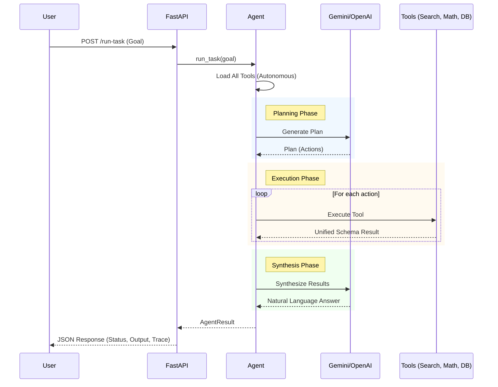

# Technical Architecture & Workflow

This document explains the internal workings of the Agent Execution Core.

## 1. System Overview

The agent is designed to be **fully autonomous**. It receives a natural language goal from the user, decides which tools are needed to solve it, executes those tools, and synthesizes a final natural language response.

### Core Components

- **Agent**: The brain. Orchestrates planning, execution, and synthesis.
- **LLM Client**: Abstraction layer for AI providers (Google, OpenAI).
- **Tools**: Executable functions (Search, Math, Governance).

---

## 2. Request Flow

Here is the step-by-step lifecycle of a user request:

### Structural Flow Diagram



### Step 1: Request Ingestion
The user sends a `POST /run-task` request with a goal.
```json
{
  "goal": "Who is Sam Altman and what is 10 + 5?"
}
```

### Step 2: Tool Selection (Autonomous)
If no specific tools are requested, the Agent automatically loads **all available tools**:
- `web_search`: For finding current information.
- `math`: For precise calculations.
- `governance_note`: For recording DAO notes.

### Step 3: LLM Planning
The Agent sends the goal and tool definitions to the LLM. The LLM generates a **Plan**:
1. Call `web_search(query="Who is Sam Altman")`
2. Call `math(expression="10 + 5")`

### Step 4: Tool Execution & Unified Schema
The Agent executes the planned tools. All tools return data in a **Unified Schema**:

```json
{
  "success": true,
  "data": { ... },       // Tool-specific raw data
  "message": "...",      // Brief summary
  "agent_response": "..." // (Optional) specific tool response
}
```

- **Web Search** uses DuckDuckGo to fetch live results.
- **Math** parses and safely evaluates expressions.
- **Governance** stores notes in a persistent SQLite database.

### Step 5: Result Aggregation
The Agent collects all tool outputs.
- If multiple tools were used, it aggregates their results.
- It generates a `natural_language_summary` combining the actions (e.g., "Found 5 search results, and Calculated 15").

### Step 6: Final Synthesis
The Agent sends the tool outputs back to the LLM to generate a cohesive **Agent Response**.
> "Sam Altman is the CEO of OpenAI... and 10 plus 5 is 15."

### Step 7: Response
The API returns the complete package to the user:
```json
{
  "status": "success",
  "output": {
    "success": true,
    "data": { ... },
    "message": "...",
    "agent_response": "Sam Altman is..."
  },
  "trace": [ ... ] // Full execution logs
}
```

---

## 3. Key Features

- **Autonomous Mode**: No need to specify tools; the agent figures it out.
- **Persistent Storage**: Governance notes are saved to a local SQLite database (`data/governance.db`).
- **Real-Time Data**: Uses real DuckDuckGo search, not mocked data.
- **Robustness**: Includes fallback mechanisms if the LLM is API-rate-limited.
